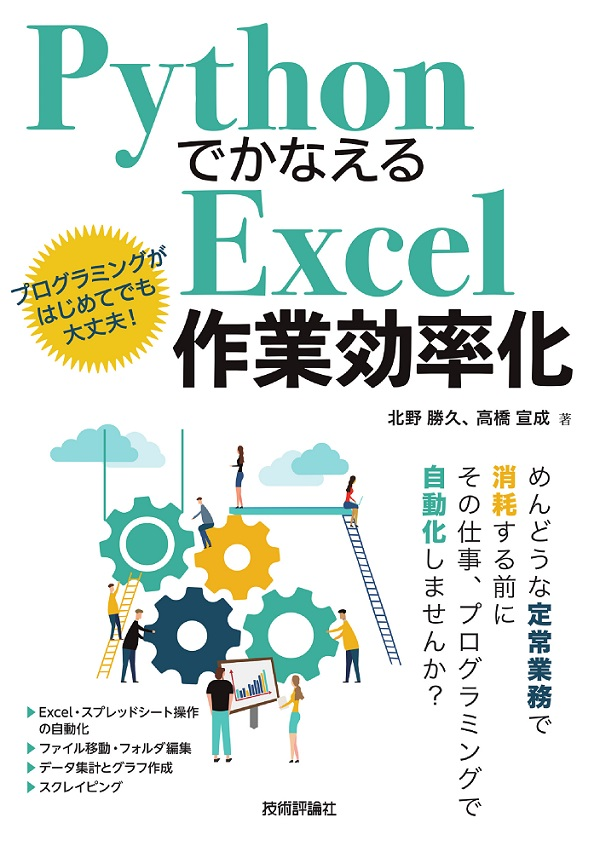

<!-- paginate: true -->

# コンピュータリテラシ発展

## 第 1 回「ガイダンス」

情報学部情報学科情報メディア専攻
清水　哲也 (shimizu@info.shonan-it.ac.jp)

---

# ガイダンス内容

1. 授業内容について
2. 履修上の注意点

---

# 授業内容について

この授業は，プログラミング言語の[Python](https://www.python.org/)を使って Excel 作業を効率化したり，自動化したりするための知識を身につける授業です．

プログラミングが主体の授業となりますので，これまでのコンピュータリテラシ基礎，応用とは大きく授業内容が異なります．履修する際はその点を良く理解した上で履修登録をしてください．

授業に必要な[Python](https://www.python.org/)の文法などは説明しますが，ゼロから全てを説明するわけではありません．なので，[Python](https://www.python.org/)を全く知らない場合は，教科書を読んで理解してください．

実行環境は，[Google Colaboratory](https://colab.research.google.com/?hl=ja)を使います．

---

# 履修上の注意点

コンピュータリテラシ発展は，この授業以外にも開講されていますが，そちらの授業はこれまで通り VBA を使った内容となっています．

Excel と VBA について学びたい場合は，そちらのクラスを受講することを勧めます．

教科書は，「[Python でかなえる Excel 作業効率化](https://gihyo.jp/book/2020/978-4-297-11450-3)」を使用しますので，VBA の教科書を購入しないようにしてください．

